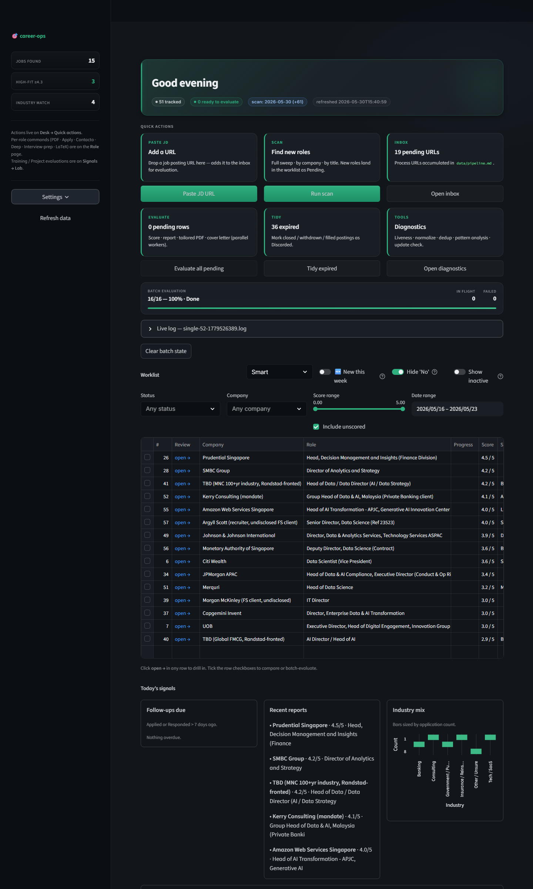
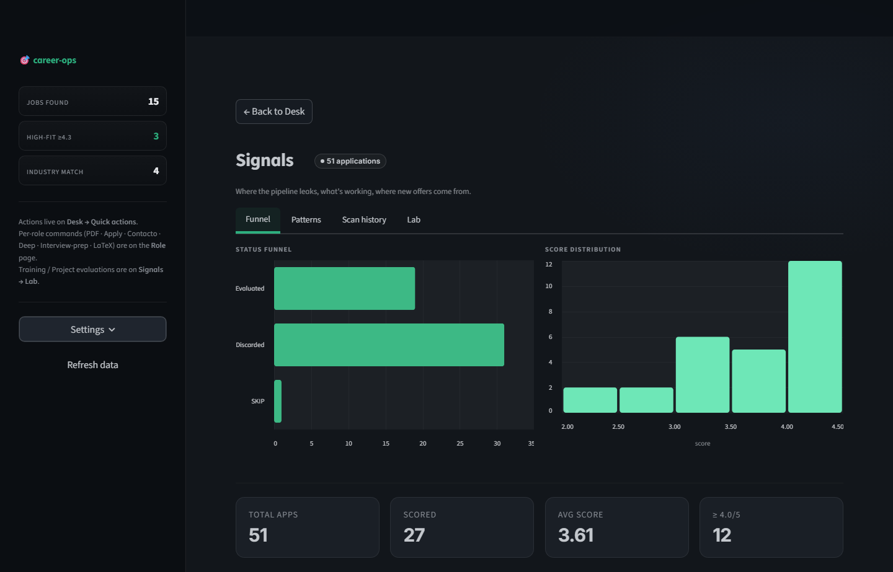
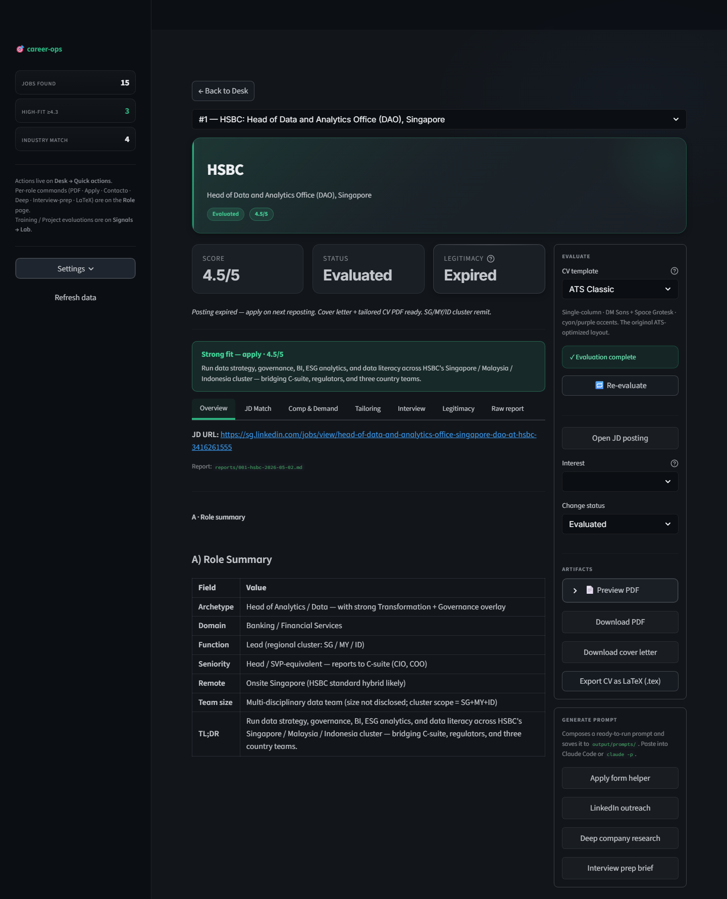

# career-ops-ui

> A fork of [**santifer/career-ops**](https://github.com/santifer/career-ops) that adds a **Streamlit web UI**, two extra **zero-token scan providers** (Workday + MyCareersFuture), and a **four-mode portal scanner** on top of the original engine. It works for **any** job search — you set your own titles, location, salary, and industries on first run.

<p align="center">
  
  
  
  
  
  
</p>

---

## What this is

[career-ops](https://github.com/santifer/career-ops) is an AI job-search pipeline built by [santifer](https://santifer.io) and driven from an AI coding CLI (Claude Code, Gemini, OpenCode…). It evaluates job offers (A–G scoring), generates tailored CVs, scans job portals with **zero LLM tokens** (pure HTTP/JSON against ATS APIs), tracks the pipeline in markdown, and runs batch evaluations.

**This fork keeps the original engine and adds a clickable front-end + more scan reach**, so the whole flow — *scan → see new roles → evaluate → CV/PDF* — can be driven from a browser, not just the agent.

It's not tied to any one career, market, or industry. You configure it once for whatever you're searching for — for example, you could tune it to insurance roles in Singapore, backend roles in Berlin, or data-engineering roles anywhere — and the same profile drives both the scan and the scoring.

> The upstream project is the source of truth for the core engine and the agent skills. The original README is preserved at [`docs/UPSTREAM_README.md`](docs/UPSTREAM_README.md) and online [here](https://github.com/santifer/career-ops#readme) — read it for the full philosophy, scoring model, and CLI usage.

---

## Setup (new users start here)

Five minutes from clone to a running dashboard wired to your own profile.

1. **Clone the repo.**

   ```bash
   git clone https://github.com/pbhat89/career-ops-ui.git
   cd career-ops-ui
   ```

2. **Install dependencies.** See [Dependencies](#dependencies) below for what's required vs optional. At minimum, run `npm install` once in the repo root.

3. **Launch the UI.**

   - **Windows:**

     ```cmd
     career-dashboard-web.bat
     ```

     First run builds a venv at `dashboard-web/.venv` and installs the Python deps; later runs reuse it. Opens at **http://localhost:8765**.

   - **macOS / Linux:**

     ```bash
     python -m venv dashboard-web/.venv
     dashboard-web/.venv/bin/pip install -r dashboard-web/requirements.txt
     dashboard-web/.venv/bin/streamlit run dashboard-web/app.py --server.port 8765
     ```

4. **First-run onboarding wizard.** On a fresh clone the app detects that your user files are missing and opens a **setup wizard** instead of the dashboard. It collects:

   - **Full name + contact**
   - **Target job titles** (what you want to be found for)
   - **Location** — city / country, plus remote preference
   - **Salary expectation** — currency + range
   - **Industries** — multi-select (examples: Insurance/Reinsurance, Banking/Financial Services, Healthcare/Pharma, Technology/SaaS, Consulting, Government/Public, Retail/Consumer, Telco/Logistics/Energy, Other)
   - **Preferences / deal-breakers** — e.g. no on-site, no startups under 20 people

   It writes these to `config/profile.yml`, `modes/_profile.md`, and `portals.yml`.

5. **These same settings drive everything.** Evaluations/scoring **and** the WebSearch scan both read your profile (titles × industries × location) by default. Set it once and the whole pipeline is tuned to you — no per-run configuration.

6. **Your data is gitignored.** All of these are excluded from git so your personal job-search data never gets committed or pushed:

   ```
   cv.md   config/profile.yml   modes/_profile.md   portals.yml
   data/*   reports/*   output/*
   ```

   The templates that **are** committed (and seed the wizard) are `config/profile.example.yml`, `templates/portals.example.yml`, and `modes/_profile.template.md`.

7. **Reset to a fresh profile.** Delete the user files above and relaunch the UI — the onboarding wizard runs again from scratch.

> Prefer the agent? Open the repo in Claude Code and say *"set me up"*. It runs the same onboarding (per [`CLAUDE.md`](CLAUDE.md) → *First Run — Onboarding*): paste your CV or LinkedIn, give it your name / location / target roles / salary, and it creates the same files.

---

## Dependencies

| Tool | Required? | Used for |
|---|---|---|
| **Node.js 18+** | **Required** | The zero-token scan engine and all `*.mjs` scripts. The three engine scan modes (Full sweep / By company / By title) and portal scanning need **only Node** — no LLM, no tokens. |
| **Python 3.10+** | **Required** | The Streamlit web UI. |
| **An LLM CLI** | Required only for evaluations + WebSearch scan | Scoring, tailored CVs, and the 4th *Web search (Claude)* scan mode. See options below. |
| **Go 1.24+** | Optional | Only to rebuild the terminal UI (`dashboard/`). The prebuilt binary ships with the repo. |

Run `npm install` once in the repo root (installs `js-yaml`, Playwright, etc.).

**LLM CLI options** (pick one — needed only for **Evaluate** and the **Web search (Claude)** scan mode):

- **Claude Code CLI** with a **Claude Max/Pro subscription**, signed in via `claude login` (OAuth — i.e. "cloud" / subscription auth, no API key needed). This is the primary path.
- **OR** an **`ANTHROPIC_API_KEY`** environment variable (pay-as-you-go API).
- **OR** a **fallback CLI**: Gemini CLI (`gemini-eval.mjs` + `.gemini/` commands), OpenCode, Codex, or Qwen — see [`AGENTS.md`](AGENTS.md) → *Headless / Batch Mode* for the per-CLI commands.

**No LLM CLI at all?** The engine scan (Full sweep / By company / By title) and the tracker still work fully. Only **Evaluate** and the **Web search (Claude)** scan mode are unavailable until you add one.

---

## What this fork adds on top of upstream

| Add-on | Where | Notes |
|---|---|---|
| **Streamlit web dashboard** | [`dashboard-web/`](dashboard-web/) | Desk / Role / Signals pages + onboarding wizard. Not in upstream. |
| **Workday provider** | [`providers/workday.mjs`](providers/workday.mjs) | Zero-token scan of `*.myworkdayjobs.com` tenants. |
| **MyCareersFuture provider** | [`providers/mycareersfuture.mjs`](providers/mycareersfuture.mjs) | Zero-token scan of the Singapore gov job-board API. |
| **Four-mode scanner + live log** | [`scan.mjs`](scan.mjs) · [`dashboard-web/pages/desk.py`](dashboard-web/pages/desk.py) | Full sweep · by company · by title (zero-token engine) + Web search (Claude, opt-in), with a streaming progress log. |
| **Tracker promotion** | [`dashboard-web/`](dashboard-web/) | Pick scan results with tick-boxes and add them to the worklist as *Pending*, then evaluate from the table. |

Everything else — the `.mjs` engine, the agent skills, batch runner, report format, Go TUI — is upstream's. The fork stays mergeable with upstream (`upstream/main` is tracked read-only).

---

## Screenshots

**Desk** — landing page: hero + freshness, quick actions, the worklist (filter / sort / multi-select to evaluate), and signals below the fold.



**Scan dialog** — the four-mode scanner. Each mode streams a live log; results come back with tick-boxes so you choose which roles to add to the worklist as *Pending*.


**Signals** — funnel, score distribution, rejection patterns, scan history, and a Lab for one-off training/project evaluations.



**Role** — single-application drill-in: evaluation tabs, CV/PDF generation, status & interest.



---

## Running it

### Web UI (Streamlit) ⭐ recommended

See [Setup](#setup-new-users-start-here) above. Once running, from the UI you can: **Scan** (four modes), review the worklist, **Evaluate** rows (spawns LLM workers), generate CVs/PDFs, and run diagnostics.

### Terminal UI (Go TUI)

A keyboard-driven pipeline viewer lives in [`dashboard/`](dashboard/).

```cmd
:: run the prebuilt binary, pointed at the repo root (which holds data/)
dashboard\career-dashboard.exe -path .
```

Rebuild from source (requires Go 1.24+):

```bash
cd dashboard
go run . -path ..      # run against the parent repo
# or: go build -o career-dashboard.exe .
```

### Claude Code (the agent)

Open the repo in Claude Code and talk to it: paste a JD URL to evaluate, or run `/career-ops scan` for a WebSearch-based scan. See [`CLAUDE.md`](CLAUDE.md) for all modes.

---

## How the scan works

```
portals.yml ── tracked_companies ──► scan.mjs (engine, zero-token) ──► dashboard "Scan" (modes 1–3)
            └─ search_queries ───────► Web search (Claude) ────────────► mode 4 (LLM, opt-in)
```

The dashboard scanner has **four** modes:

- **🔄 Full sweep** — every API-backed company, your title filter; new roles since last scan *(zero-token engine)*
- **🏢 By company** — one company across all its portals *(zero-token engine)*
- **🔎 By title** — find roles matching a title you type, overrides the title filter *(zero-token engine)*
- **🌐 Web search (Claude)** — runs your `search_queries` (LinkedIn, job boards, recruiters) through an LLM + WebSearch. Best-effort and **uses tokens** — opt-in, gated behind a warning.

After a scan, results appear with **tick-boxes** so you choose which roles to **add to the worklist** as **Pending** (with their JD URL). From there you select rows and **Evaluate** them straight from the table.

<a id="why-the-engine-modes-are-api-only"></a>
**Why the three engine modes are API-only:** `scan.mjs` is a pure HTTP/JSON process with **no LLM** — that's what makes it free and instant. WebSearch needs an agent to form queries, read snippets, judge relevance, and extract `{title, company, url}` — work only an LLM can do. That's why WebSearch lives in its own **4th mode** (which shells out to an LLM CLI and costs tokens) and in `/career-ops scan`, kept separate from the zero-token engine.

---

## Repo layout (fork-specific bits)

```
career-ops-ui/
├── scan.mjs                    # zero-token scanner (+ --json / --title / multi-mode support)
├── providers/                  # scan engines — workday.mjs + mycareersfuture.mjs are this fork's
├── portals.yml                 # YOUR companies + queries + title filter (user layer, gitignored)
├── dashboard-web/              # Streamlit UI (Desk / Role / Signals) + onboarding wizard
│   ├── app.py                  #   entry: sidebar, onboarding gate, router
│   ├── pages/ · services/      #   pages never touch files directly — go via services/
│   └── README.md               #   UI internals
├── dashboard/                  # upstream Go TUI
├── modes/                      # evaluation/apply prompts (_profile.md = user layer)
├── data/ · reports/ · output/  # YOUR data (gitignored)
└── CLAUDE.md / AGENTS.md       # agent instructions + onboarding
```

---

## Credits & license

- Original system, engine, and agent skills: **[santifer/career-ops](https://github.com/santifer/career-ops)** by [santifer](https://santifer.io) — the matching portfolio is open source too: [cv-santiago](https://github.com/santifer/cv-santiago). The original README is preserved at [`docs/UPSTREAM_README.md`](docs/UPSTREAM_README.md).
- This fork: the Streamlit dashboard, Workday + MyCareersFuture providers, and four-mode scanner.
- License: **MIT** (inherited from upstream — see [`LICENSE`](LICENSE)).

Updates from upstream pull cleanly: `node update-system.mjs check` (system files only; your CV, profile, tracker, and reports are never touched).
